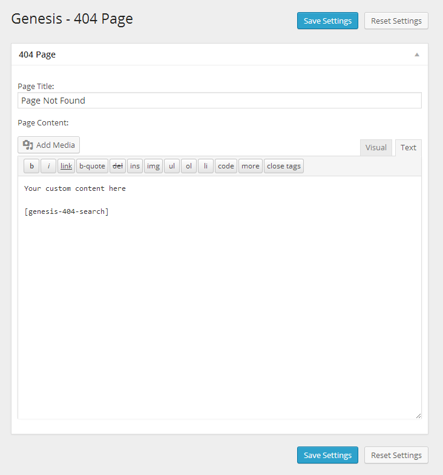

# Genesis 404 Page

Customize the content of the 404 Page within the Genesis Theme Framework.

## Description

Customizing the contents of the Page Not Found page in any WordPress theme can be tricky, and usually involes editing the 404.php template file. The Genesis Framework already abstracts the default content of the page into a function, and this plugin can unhook that and replace it with your own custom title and content.

## Screenshots

  
_Screenshot 1 caption HERE._

## Requirements
 * WordPress 3.0+
 * Genesis Framework 1.8+ (supports HTML5 for Genesis Framework 2.0+)

## Installation

### WP .org repo

1. On the Add Plugin screen, search for _Genesis 404 Page_ and follow the usual steps.

### Upload

1. Download the latest tagged archive (choose the "zip" option).
2. Go to the __Plugins -> Add New__ screen and click the __Upload__ tab.
3. Upload the zipped archive directly.
4. Go to the Plugins screen and click __Activate__.

### Manual

1. Download the latest tagged archive (choose the "zip" option).
2. Unzip the archive.
3. Copy the folder to your `/wp-content/plugins/` directory.
4. Go to the Plugins screen and click __Activate__.

Check out the Codex for more information about [installing plugins manually](http://codex.wordpress.org/Managing_Plugins#Manual_Plugin_Installation).

### Git

Using git, browse to your `/wp-content/plugins/` directory and clone this repository:

`git clone git@github.com:billerickson/Genesis-404-Page.git`

Then go to your Plugins screen and click __Activate__.

## Updates

This plugin supports the [GitHub Updater](https://github.com/afragen/github-updater) plugin, so if you install that, this plugin becomes automatically updateable direct from GitHub.

See [CHANGES.md](changes.md) for the plugin changelog.

## Usage

Once installed, you can customize your 404 page's title and content in Genesis > 404 Page. 

Use the [genesis-404-search] shortcode to add a search form to the page.

If you'd like to dynamically list content (ex: most recent posts), I recommend you install the [Display Posts Shortcode](http://www.wordpress.org/extend/plugins/display-posts-shortcode/) and use it in the 404 page's content.

## Credits

Built by [Bill Erickson](http://twitter.com/BillErickson) and [Gary Jones](https://twitter.com/GaryJ)  
Copyright 2012 [Bill Erickson](http://www.billerickson.net)
